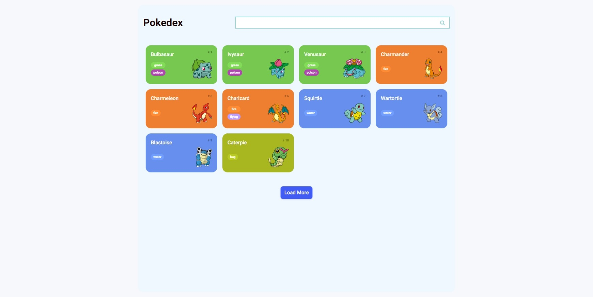
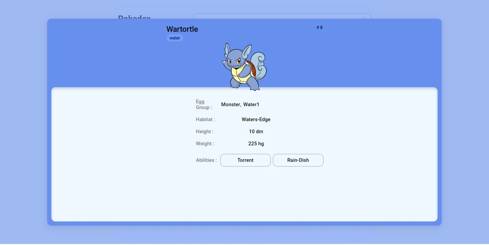
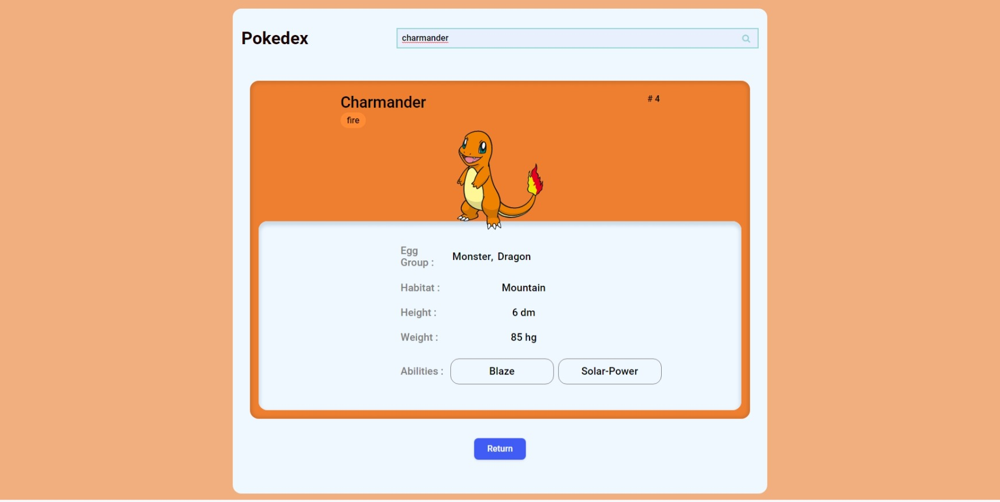
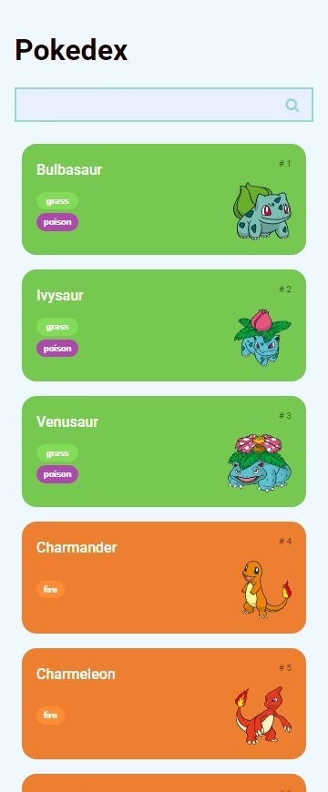
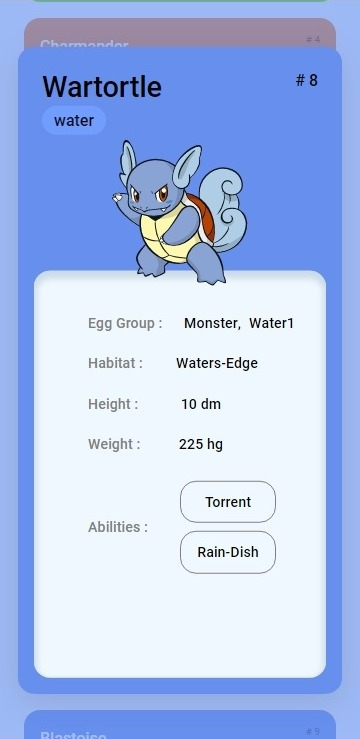
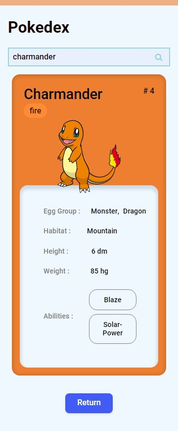

# Pokedex &nbsp; &nbsp; &nbsp;  &nbsp; 

This is a solution to Building a Pokédex with JavaScript from [Digital Innovation One](https://www.dio.me/en). Dio.me is the platform for you to learn from experts, master the main technologies and enter the most desired companies faster.

This Pokedex load all pokemons and when you click on a pokemon, some details about the chosen pokemon will appear. It's possible to search for a specific pokemon and also look up just for types

  

<b>Build with:</b>  

## Table of contents

- [Overview](#overview)
  - [The challenge](#the-challenge)
  - [Project Composition](#project-composition)
  - [Screenshot](#screenshot)
  - [Links](#links)
- [My process](#my-process)
  - [Built with](#built-with)
  - [What I learned](#what-i-learned)
- [Useful Resources](#useful-resources)
- [Author](#author)
- [Acknowledgments](#acknowledgments)

 

## Overview

### <b id="the-challenge">The challenge</b>
- The project goals was develop a pokedex that displays multiple pokemons and create a page that displays the details of the chosen pokemon.

Extra:
- Search for a specific pokemon

### <b id="project-composition">Project Composition</b>
Done:
- Consume Pokemon RESTful API
- Build webpage dinamically
- Create pagination
- Limit to show only first generation Pokemons
- Create Pokemon Description page

Extra:
- When you click on a pokemon, display the details of the chosen pokemon at middle of screen
- Search for a specific pokemon
- Filter by type
- Reload search list when choosing a type 
- Navigate between search and pokédex and between search type and pokédex
- Page 404 personalized
- Changes the amount of pokemon cards it loads depending on the screen size.
- Search in real time, but it only shows if the pokemon exists if you type its name in full
- Gifs in the corner of the Pokémon's description card

Bugs fixed:
- When a pokémon is selected to show its description, disable page scroll
- Some pokemons do not have habitat and this caused the pokemon not to be loaded
- The "dream_world" sprite does not exist for all pokemons, so now the "official-artwork" sprite is being used
- Don't load pokemons that don't have a sprite

### <b id="screenshot">Screenshot</b>

    

Desktop view

    
    
    

Phone view

    
    
    

### <b id="links">Links</b>
- Solution URL: [GitHub Repository](https://github.com/bemibrando/pokedex/)
- Live Site URL: [GitHub Pages](https://bemibrando.github.io/pokedex/)

 

## My process

### <b id="built-with">Built with</b>
- Semantic HTML5 markup
- CSS
- JavaScript
- PokeApi
- #region to organize some parts of the code

### <b id="what-i-learned">What I learned</b>
- How to consume RESTful API
- How to manipulate the result of the request through a Promise
- How to use function Map to decrease code verbosity
- How to handle multiple requests in parallel
- How to convert PokeApi model to my model
- How to add subitems to HTML dinamically
- How to add pagination and remove the button when it reaches the limit

## <b id="useful-resources">Useful Resources</b>
- [Saepul Nahwan - Pokedex App](https://dribbble.com/shots/6540871-Pokedex-App) - This design was used as inspiration to develop this webpage.
- [Pokemon RESTful API](https://pokeapi.co/) - All the Pokémon data you'll ever need in one place,
easily accessible through a modern RESTful API.
- [DIO.me - Digital Innovation One](https://www.dio.me/en) - Dio.me is the platform for you to learn from experts, master the main technologies and enter the most desired companies faster.
- [CSS Search Box](https://blog.stackfindover.com/css-search-boxes/) - Inspiration for Search Box Design
- [CSS Box Shadow Examples](https://getcssscan.com/css-box-shadow-examples) - Used for add box shadow
- [CSS Buttons Examples](https://getcssscan.com/css-buttons-examples) - Used for add styled buttons
- [IconScout](https://iconscout.com/) - For free icons

## Author

    <figure>
        <a href="https://github.com/bemibrando" target="_blank">
              
            <b>Bianca Emi</b>
        </a>
    </figure>
    
Made with ♥ by <a href="https://github.com/bemibrando" target="_blank">Bianca Emi</a> 👋 Get in touch!

    

           
           
         
    

## Acknowledgments
» Renan J. de Paula - Taught me how to develop a pokedex that displays multiple pokemons

    
    

 

» Mateus Rocha - Inspired me to make the pokemon search page

    
    

» Rodrigo Withers - Suggested me to filter by type of pokemon

    
    

